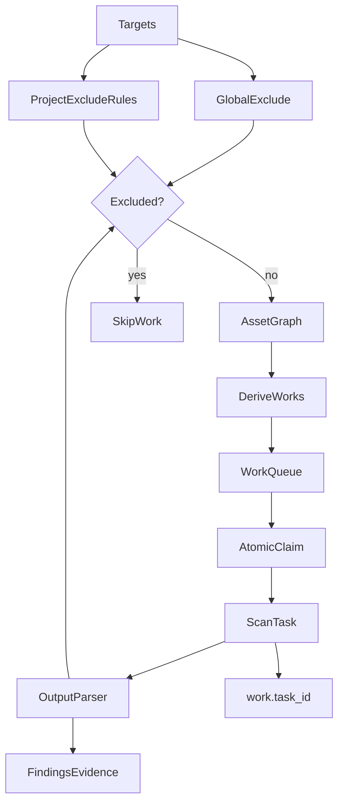

# 资产驱动扫描修复设计（2026-06-03）

本文档是本轮「评审修复」的源头说明，对应实施计划 `project-remediation` / `remediation_subagents`。

## 背景

Anchor 主执行路径已切换为 **资产驱动 ScanEngine**（`scan_work_items` 为调度真相，`pipeline_run_stages` 为 UI 聚合投影）。评审发现：排除边界不完整、HTTP→Nuclei 链路断裂、Nuclei 未入库、测试/发布门禁缺失。

## 设计原则

| 原则 | 说明 |
|------|------|
| **Exclusion-only** | 扫描即发现，无法预先枚举「应包含」资产。未命中排除规则 → **允许**继续发现链；命中排除 → **禁止**派生 work/入库扫描。 |
| **Include 规则废弃** | `scope_rules.action=include` 在本轮起 **不再参与评估**（DB 保留，API 可列示但应标注废弃，避免误配）。 |
| **双层排除** | 全局 `exclude.Manager`（公共域名降噪）+ 项目 `scope_rules`（用户声明不可扫目标），任一命中即排除。 |
| **Work ↔ Task** | 每个 `scan_work_item` 关联 `scan_tasks.id`，用于日志、审计与前端跳转。 |
| **Findings 为 Nuclei 出口** | 资产驱动路径不得仅写 stdout；须 dedup + Evidence。 |

## P0 / P1 风险清单

| 级别 | 风险 | 修复项 |
|------|------|--------|
| P0 | 发现资产未过项目排除规则 | `scope.Engine` exclusion-only + ScanEngine `processNewAsset`/seed |
| P0 | Nuclei 命中未进 Findings | `scanengine` persister + `parser.ParseNuclei` |
| P0 | `go test ./...` import cycle | `toolregistry` 测试去 `worker` 依赖 |
| P1 | domain/IP 无 httpx → nuclei 链 | rules bridge + `Fingerprinted` 回写 |
| P1 | `TryClaim` 非原子 | `UPDATE ... WHERE status=pending` |
| P1 | metrics/works API 无 project 归属校验 | handler 校验 run∈project |
| P1 | Docker 发布 checkout main 漂移 | `docker-push.yml` 对齐 release tag |
| P1 | 无 PR CI | `.github/workflows/ci.yml` |

## 范围

### 本轮做

- 全局 `scope.evaluate` / `FilterTargets`：**exclusion-only**（默认 allow，忽略 include）。
- ScanEngine：排除 guard、HTTP 链路、Nuclei 入库、PipelineConfig 驱动、task_id、原子 claim、API 归属。
- 测试：Go 全绿、CI workflow、E2E smoke 硬断言（Redis、≥1 finding）。
- 部署：release tag 对齐、Makefile/Dockerfile 修正、compose 卷分离说明。

### 本轮不做

- 移除 legacy `discovery.go` / `screenshot.go` workflow（维护模式保留）。
- Scope UI 大改（仅文档/API 标注 include 废弃）。
- `privileged` capability 最小化（文档威胁模型，后续迭代）。
- 默认 PR 门禁跑完整 rangefield E2E（仅 smoke + nightly 分层）。

## 目标数据流



## API / DB 变更

| 变更 | 说明 |
|------|------|
| `scan_work_items.task_id` | 可空 FK → `scan_tasks.id`，claim 后写入 |
| `scope.evaluate` 语义 | 仅 exclude 生效；无规则 → allow |
| 新/用 `scope.Engine.IsExcluded(projectID, target)` | ScanEngine 高频路径，不 persist 每条子域 |
| `GET .../works`、`GET .../metrics` | 校验 `run.project_id == path project_id` |

## Exclusion-only 迁移说明

**行为变化**：此前仅配置 `include`、无 `exclude` 的项目，在旧 `evaluate` 下默认 **deny**；迁移后默认 **allow**，扫描面可能扩大。

**建议操作**：

1. 审计各项目 `scope_rules`：将原「靠 include 圈定」改为显式 `exclude` 列表（或依赖全局 exclude）。
2. 前端/API 创建规则时优先引导 `exclude`；`include` 显示「已废弃」。
3. E2E 使用未命中 exclude 的 rangefield 目标；若失败检查是否误配 exclude。

## 测试矩阵

| 层级 | 命令 / 场景 | 通过标准 |
|------|-------------|----------|
| 单元 | `go test ./internal/scope/...` | exclusion-only 用例绿 |
| 单元 | `go test ./internal/scanengine/...` | guard、rules、claim、nuclei persister |
| 单元 | `go test ./internal/toolregistry/...` | 无 import cycle |
| 门禁 | `go test ./...`、`go vet ./...` | 全绿 |
| 前端 | `npm run typecheck && test:unit && build` | 全绿 |
| CI | `.github/workflows/ci.yml` on PR | 上述门禁 |
| E2E smoke | `make test-e2e-smoke` | Redis 可见、≥1 finding |
| 手工 | rangefield 实扫 | Findings 页有 Nuclei 命中 |

## 验收标准（总闸）

必须通过：

```bash
go test ./...
go vet ./...
cd frontend && npm run typecheck && npm run test:unit && npm run build
make test-e2e-smoke
```

手工：启动一次 rangefield 扫描 → works 完成 → Findings/报告可见漏洞条目。

## 遗留项

- Scope 前端移除 include 创建入口。
- Worker compose 最小 capability 替代 `privileged`。
- 专用 nightly workflow 跑 `high-risk-pipeline` 全量断言。
