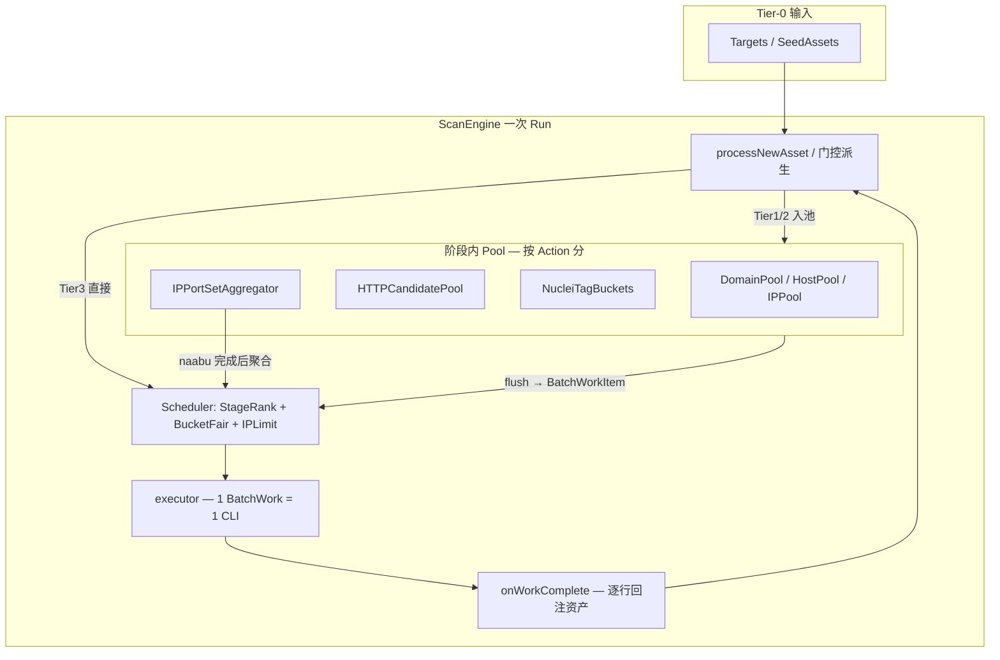

# 批量扫描调度 — Design

## 背景与动机

当前 `ScanEngine.processNewAsset` 对每个资产调用 `DeriveEligibleWorks`，为每个 `(asset_id, action)` 创建一条 `scan_work_item`，`buildParams` 再为 **单个 host** 写临时文件并 spawn 一次 CLI。

1067 个 domain 在 external profile 下典型膨胀：

```
domain → DNS + httpx (+ CDN 经 IP 链)
IP     → CDN + port + httpx
IP:port → nmap + httpx
```

实测：2473 资产 → 6597 work → 5791 tool call。批量合并后预期 ~150–200 次 CLI（见 §AD-B2 表）。

**设计原则**：批量粒度由工具的 **输入同质性** 与 **输出可归因性** 决定，而非「所有工具共用一个池」。

---

## 架构总览



---

## AD-B1：Work 模型 — BatchWorkItem

### 现状

```go
// scan_work_items: 1 row = 1 asset × 1 action
ScanWorkItem { RunID, AssetID, Action, Status, ... }
```

### 目标

保留 `scan_work_items` 表，扩展 **批量 work** 语义（二选一，Implement 时定稿）：

**方案 A（推荐）**：新增 `batch_id` + `input_file` + `member_asset_ids` JSON 列，单条 work 表示一批。

**方案 B**：新增 `scan_batch_work_items` 表，与现有表并存；UI 统一展示。

### BatchWorkItem 字段（逻辑模型）

| 字段 | 说明 |
|------|------|
| `action` | 同现有 TaskAction；批量动作与单体动作同名（如 `DNS_RESOLVE`） |
| `input_file` | `-l` / `-i` 文件路径 |
| `member_asset_ids` | 本批覆盖的资产 ID 列表（血缘、归因） |
| `bucket_key` | `target:{id}` 或 `template_set:{hash}` |
| `generation` | Pool flush 序号 |
| `template_set` | 仅 nuclei：tags / workflow_dir / template_path |
| `port_set` | 仅 nmap：该 IP 的开放端口列表 |

### 输出归因

每种工具必须在 `onWorkComplete` 按 **行/记录** 映射回 member assets：

| 工具 | 归因键 |
|------|--------|
| dnsx | 每行 host |
| naabu | host + port |
| cdncheck | ip |
| httpx | url / host |
| nmap | ip + port |
| nuclei | matched-at / host → asset |

---

## AD-B2：三层批量分类（SSOT）

### Tier 1 — 大池批量

输入参数对所有成员完全相同；输出逐行可映射。

| Action | Pool | Flush 条件 | CLI 形态 | 预期 batch 大小 |
|--------|------|------------|----------|-----------------|
| `SUBDOMAIN_ENUM` | `DomainPool` | 50 域 / 10s | subfinder `-dL` | 50 |
| `DNS_RESOLVE` | `HostPool` | 100 host / 10s | dnsx `-l` | 100 |
| `CDN_CHECK` | `IPPool` | 100 IP / 10s | cdncheck `-i` | 100 |
| `PORT_SCAN` | `IPPool` | 50 IP / 10s | naabu `-l` + 统一 `port_range` | 50 |

**已有代码**：`internal/scanengine/domainpool/pool.go`（仅 subfinder 场景，**未接入 engine**）。

### Tier 2 — 同质分组批量

参数在组内相同，组间不同。

| Action | 分组键 | Work 粒度 | 说明 |
|--------|--------|-----------|------|
| `HTTPX_FINGERPRINT` | probe target 去重 | 100 target/批 | subdomain/IP/IPPort 合并为 probe 列表 |
| `SERVICE_FINGERPRINT` | IP | **1 IP × 全部 open ports/次** | 见 AD-B6 |
| `NUCLEI_SCAN` | TemplateSet（tech 路由） | 20–50 URL/批 | 见 AD-B5 |

### Tier 3 — 单点 / 极小批

参数因目标而异，低并发。

| Action | 粒度 | 门控 |
|--------|------|------|
| `KATANA_CRAWL` | 1 URL | `isHighValueHTTP` |
| `SPOOR_SCAN` | 1 URL | `isHighValueHTTP` |
| `FFUF_BRUTE` | 1 URL | `isHighValueHTTP` + enable |
| `NUCLEI_SCAN` | 1 URL | 仅 custom `template_path` 单点路由 |

### 1067 domain 预期 CLI 次数（修正估算）

| 阶段 | 旧 work 量级 | 新 CLI 量级 |
|------|-------------|-------------|
| dnsx | ~2000 | ~22 |
| cdncheck | ~800 | ~16 |
| naabu | ~800 | ~22 |
| nmap | ~800（每 port） | ~1067（每 IP，若全开 nmap） |
| httpx | ~2500 | ~50 |
| nuclei | ~400 | ~20–40（按 tag 桶） |
| **合计** | **~6597 work** | **~150–200 CLI** |

---

## AD-B3：阶段门控 + 阶段内池化

**不是**全局一个大池。阶段顺序（与 `queue/stage_rank.go` 一致）：

```
discovery(seed) → subdomain → resolve → cdn → port → service → web → crawl → brute → vuln
```

### 规则

1. **Pop 时**：仅当不存在更高优先级 stage 的 pending/running work 时，才 pop 当前 stage（`PopFairStaged`）。
2. **入池时**：新资产派生的 work **进入对应 stage 的 Pool**，而非立即创建 per-asset DB row（flush 时批量写入）。
3. **阶段完成触发**：
   - nmap（AD-B6）：某 IP 的 naabu work 所在批完成后，触发 IP port-set 聚合，再派生 nmap work。
   - nuclei（AD-B5）：某 URL 的 httpx 完成且 `technologies` 写入 `asset_state` 后，进入 TagBucket。

### wind_down 语义

取消硬超时后，用户 Cancel 或 orphan 恢复时：

- 当前 stage 允许 finishing actions（httpx/nuclei 可配置）
- Pool 中未 flush 的成员：**强制 flush 或 mark skipped**

---

## AD-B4：调度器接线（hw-scan-optimization 欠账）

### 现状（代码存在、engine 未用）

| 组件 | 路径 | 状态 |
|------|------|------|
| Stage rank 定义 | `queue/stage_rank.go` | ✓ 定义 |
| `PopFairStaged` | 仅 `stage_rank_test.go` 引用 | **✗ 无实现** |
| `PopFair` | 仅 `fair_test.go` 引用 | **✗ 无实现** |
| `ComputeLimits` | `scheduler/limits.go` | ✓ 有单测，engine 未调用 |
| `IPThrottler` | `scheduler/ip_throttle.go` | ✓ 有单测，engine 未调用 |
| `SeedBucketKey` | `scheduler/bucket.go` | ✓ 未用于 Pop |
| `domainpool.Pool` | `domainpool/pool.go` | ✓ 未 import engine |

### 目标 `engine.tick` 流程

```
1. ComputeLimits(seedCount, elapsed) → globalMax, activeBuckets, perBucketMax
2. 各 Pool 超时 flush
3. ListPending + 内存 queue 合并（保留 WorkID dedup）
4. PopFairStaged(perBucketMax, activeBuckets, bucketInflight, stageGate)
5. executeWork 前 IPThrottler.Acquire(host)
6. 动态 sem 宽度 = globalMax（替代固定 BatchSize=5）
```

### 移除 / 调整

| 项 | 动作 |
|----|------|
| `queue.ClassifyAction` High/Med/Low | 由 StageRank 取代优先级；可 deprecate |
| `EngineConfig.BatchSize` | 改为 `MinBatchConcurrency` 或删除，主限流用 `ComputeLimits` |
| `EngineConfig.AbsoluteTimeout` | **删除默认值**（AD-B7） |
| `EngineConfig.IdleTimeout` | 保留为可选 wind_down 触发，默认关闭或极大值 |

---

## AD-B5：Nuclei — Tech 路由分桶（弃用策略 A）

### 弃用：宽 tag 批量（策略 A）

对 50 URL 跑 `-tags exposure,cve` 仅减少进程数，**template×target 组合数不变**（可达数十万），护网不可接受。

### 基线：策略 B' — TemplateSet 同质分桶

```
httpx 完成 → asset_state.technologies[]
           → 查 nuclei_tech_routing 表
           → 相同 TemplateSet 的 URL 进入同一 Pool
           → flush → nuclei -l batch.txt -tags <桶专属 tags>（≤max_templates）
```

### 配置 SSOT：`configs/scan.config.yaml`

```yaml
nuclei_tech_routing:
  jenkins:
    tags: [jenkins]
    max_templates: 25
  nginx:
    tags: [nginx, nginx-version]
    max_templates: 10
  apache:
    tags: [apache, apache-detect]
    max_templates: 10
  tomcat:
    tags: [tomcat]
    max_templates: 15
  _default:
    action: skip          # noise_level=low
  _fallback:
    tags: [tech-detect]
    max_templates: 5
```

### noise_level 行为

| noise_level | 无 tech URL | 未知 tech | 已知 tech |
|-------------|------------|-----------|-----------|
| `low`（默认） | skip | skip 或 ≤5 templates | 路由表，≤max_templates |
| `standard` | ≤20 misconfig | ≤10 tech-detect | 路由表 + medium severity |

### 与 custom nuclei 集成

- `NucleiCustomSource.RoutingPolicy` 可覆盖/扩展 tech→template 映射
- `template_path` 单点 workflow **不进池**，走 Tier 3

### 派生规则变更

- 删除「每个 fingerprinted HTTP 资产立即 Create NUCLEI_SCAN work」
- 改为：**httpx 批完成 → 按 tech 分桶 → 桶满 flush 才 Create work**

---

## AD-B6：Nmap — IP 级 port-set 聚合

### 不做

- 全局 IP:port 大池 + 单一 `-p` 列表
- 维持 1 IP:port = 1 nmap（当前）

### 做法

```
naabu batch 完成 → 解析每 (ip, port)
                 → 按 IP 聚合 open_ports[]
                 → 1 work: nmap -iL {ip} -p {ports_csv}
                 → 解析 XML 逐 port 回注 service fingerprint
```

### 工具侧

`fingerprint.BuildNmapServiceScanCommand` 已支持 `-iL` + `-p` 多端口；改 **派生层**，不改 CLI 封装。

### 可选增强（P2）

同质端口批：所有开放 443 的 IP → `nmap -p 443 -iL ips.txt`。

---

## AD-B7：Run 生命周期（无硬超时）

### 原则

- **不设**默认 `AbsoluteTimeout`；目标多、扫描时间长是正常业务场景。
- 正常结束：`AllWorkItemsTerminal && queueEmpty && inFlight==0` → `finalizePipelineRun(completed)`。
- 用户 Cancel：ctx cancel + skip pending + **mark running 僵尸 failed/skipped**。

### Orphan run 恢复（Server 启动）

```
ListPipelineRuns(status=running)
  → 无对应 pipelineCancels goroutine
  → Mark running work items → failed("server_restart")
  → skip pending → failed 或 resume 可选
  → UpdatePipelineRunStatus(failed|cancelled) + engine_state=stopped
```

### finalizePipelineRun 补强

当前仅 skip **pending**，不处理 **running** 僵尸 → `AllWorkItemsTerminal` 永远 false。需：

```go
// 对 running 且 task 已 terminal / 超时无 heartbeat 的 work → failed
```

### Resume

沿用已有 `POST .../pipeline/runs/{runId}/resume`；批量 work 未完成时 resume 重新 flush 未完成 stage 的 Pool 状态（从 DB pending 重建）。

---

## AD-B8：CDN IP:port 归一化

### 问题

资产 value 为 `1.14.236.216:443` 时 `net.ParseIP` 失败 → `cdncheck requires IP, got domain: ...`。

### 修复点

| 位置 | 改动 |
|------|------|
| `ReconcileDiscoveryAsset` / merge | IP:port 存为 `AssetIPPort`，或 strip port 存纯 IP |
| `assetHostValue` | 统一 `SplitHostPort` → 纯 IP |
| `buildParams` CDN_CHECK | 使用归一化 IP |
| passive seed | FOFA host 含 port 时规范化 |

---

## AD-B9：前端与 API 分页

### API

| 端点 | 改动 |
|------|------|
| `GET .../pipeline/runs/{runId}/works` | 增加 `page`/`page_size`/`status`/`action` query；默认 page_size=50 |
| `GET .../pipeline/runs/{runId}/tool-calls` | 同上 |
| `GET .../metrics` | 不变（轮询主接口） |
| `GET .../summary` | 不变 |

### 前端 `RunsPage.tsx`

| 改动 |
|------|
| 运行中轮询 **仅** metrics + summary + runs list |
| works / tool-calls **选中 run 后 lazy load**，分页 |
| 明细 Tab 虚拟滚动或分页，禁止 6000+ DOM |
| `buildWorkGroups` 改为服务端聚合或仅对当前页 |

---

## AD-B10：Profile 派生规则收敛

| 规则 | 现状 | 目标 |
|------|------|------|
| `DNS_RESOLVE MaxDepth: -1` | 任意深度派生 DNS | depth ≤ 1 或「未 resolved」门控 |
| `CDN_CHECK MaxDepth: -1` | 每 IP 立即派生 | Tier1 池化；不 per-asset enqueue |
| httpx 候选 | subdomain + IP + IPPort 各一条 | HTTPCandidatePool 去重 |
| per-asset Create | 每次 processNewAsset | Tier1/2 仅入 Pool；flush 才 Create |

---

## 数据流（目标态）

```text
Seed (1067 domain)
  → DomainPool? (subfinder, depth≤1 子域)
  → HostPool → dnsx batch
  → onWorkComplete → IP assets
  → IPPool(cdn) → cdncheck batch
  → IPPool(port) → naabu batch
  → onWorkComplete → IP:port assets
  → IPPortSetAggregator → nmap (1 IP × all ports)
  → HTTPCandidatePool → httpx batch
  → asset_state.technologies
  → NucleiTagBuckets → nuclei batch (per TemplateSet)
  → Tier3: katana/spoor/ffuf (high-value only)
```

---

## 文件改动地图

### 新增

| 路径 | 用途 |
|------|------|
| `internal/scanengine/pool/host_pool.go` | DNS/CDN/Port IP 池 |
| `internal/scanengine/pool/http_pool.go` | httpx 候选池 |
| `internal/scanengine/pool/nuclei_buckets.go` | tech 分桶 |
| `internal/scanengine/pool/ip_port_agg.go` | nmap 聚合器 |
| `internal/scanengine/queue/fair.go` | `PopFair` / `PopFairStaged` 实现 |
| `internal/scanconfig/nuclei_routing.go` | 路由表加载 |
| `internal/scanengine/recovery/orphan.go` | 启动 orphan 清理 |
| `internal/db/v39.go`（或下一版本） | batch work 列/表 |

### 修改

| 路径 | 改动摘要 |
|------|----------|
| `internal/scanengine/engine.go` | tick 接线 scheduler/pools；去 AbsoluteTimeout；batch execute |
| `internal/scanengine/core/rules_external.go` | 派生改入池；MaxDepth 收敛 |
| `internal/scanengine/work/store.go` | Batch create/complete |
| `internal/api/scan_work_handlers.go` | works 分页 |
| `internal/api/pipeline_handlers.go` | orphan recovery hook；finalize running 僵尸 |
| `frontend/src/pages/RunsPage.tsx` | 分页 + 轻量轮询 |
| `frontend/src/lib/api.ts` | 分页参数 |
| `configs/scan.config.yaml` | `nuclei_tech_routing` |
| `docs/current/architecture.md` | 批量调度章节 |
| `internal/api/README.md` | 分页路由 |

### 测试

| 路径 | 覆盖 |
|------|------|
| `queue/fair_test.go` | 已有，实现后应绿 |
| `queue/stage_rank_test.go` | 已有，实现后应绿 |
| `pool/*_test.go` | flush、dedup、归因 |
| `engine_batch_test.go` | fake executor 端到端 batch |
| E2E | 100+ 目标 scan smoke：CLI 次数上限断言 |

---

## 文档同步清单（CLAUDE.md 合规）

| 代码变更 | 文档 |
|----------|------|
| `server.go` Register 新路由 | `internal/api/README.md` + server 注释 |
| `scan_work_handlers` 分页 | `internal/api/README.md` |
| 架构：Pool/BatchWork | `docs/current/architecture.md` |
| 验收场景 | `docs/functional-test.md` |
| 本 workstream 完成 | `docs/design/batch-scan-scheduling/tasks.md` 勾选 + acceptance.md |

---

## 风险与缓解

| 风险 | 缓解 |
|------|------|
| 批量失败整批重试 | 批内 partial success 解析；失败可拆半重试 |
| 归因错误导致 finding 错挂 asset | 单测 + E2E lineage 抽查 |
| nuclei 路由表不全 | `_fallback` + 低噪音 default=skip |
| 迁移期双模型（单 asset work + batch work） | P0 先接线 scheduler；P1 再切 batch |

---

## 实施顺序

见 [tasks.md](./tasks.md)：

```
P0  调度接线 + 生命周期 + CDN 修复 + 前端分页
P1  Tier1 池（dnsx/naabu/cdncheck/subfinder）
P2  Tier2（httpx 池 + nmap IP 聚合 + nuclei tech 分桶）
P3  Tier3 微调 + E2E 规模验收 + 文档收口
```
