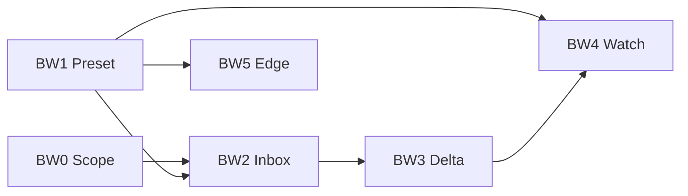

# Bounty Watch — Design

## 1. Scope 边界（BW0）

### 1.1 模式枚举

```go
// internal/models/project.go
type ScopeBoundaryMode string

const (
    ScopeBoundaryOff    ScopeBoundaryMode = "off"    // 默认：护网
    ScopeBoundaryStrict ScopeBoundaryMode = "strict" // 赏金：include + exclude
)
```

| 模式 | include 规则 | exclude 规则 | 引擎扩面 |
|------|-------------|-------------|---------|
| `off` | 忽略 | 可选：仅全局 exclude-domains + 项目 exclude（与现网 exclude-only 一致） | 自由扩面 |
| `strict` | **必须**命中至少一条 include 才允许 | 命中 exclude 则 deny（exclude 优先） | 边界外不注入、不派生 Work |

**用户确认**：护网默认 `off`；赏金手动切 `strict` 并配置 `*.target.com` 等 include 规则。

### 1.2 规则模型（沿用 scope_rules 表）

| action | 用途 | off 模式 | strict 模式 |
|--------|------|---------|------------|
| `include` | in-scope 边界 | 存储但不参与扫描过滤 | 必须命中 |
| `exclude` | OOS | 参与 exclude（可选，见下） | 参与 exclude |

`strict` 评估顺序（`internal/scope/boundary.go` 新函数 `EvaluateBoundary`）：

```text
1. 命中 exclude → deny (out_of_scope)
2. 无 include 规则 → allow（仅 exclude 生效，兼容只配 OOS 的用户）
3. 命中任意 include → allow
4. 未命中 include → deny (out_of_scope)
```

Wildcard：`*.example.com` 复用现有 `matchDomainRule`（单标签前缀）。

### 1.3 三道门

```text
Gate A — Seed（ExpandTargets 之后）
  FilterSeedsByBoundary(seeds, project) → 丢弃或标记 out

Gate B — Work（processNewAsset / enqueueWork）
  isAssetExcluded 扩展：strict 时调用 EvaluateBoundary
  skip 的 Work 写 status=skipped reason=scope_out

Gate C — Finding（Nuclei/Spoor persist）
  out-of-scope → finding.scope_status=out_of_scope
  Signal Inbox 默认 query scope=in
```

### 1.4 DB 迁移

`internal/db/v35.go`：

```sql
ALTER TABLE projects ADD COLUMN scope_boundary_mode TEXT NOT NULL DEFAULT 'off';
-- assets / findings 可选列：
ALTER TABLE assets ADD COLUMN scope_status TEXT NOT NULL DEFAULT 'unknown';
ALTER TABLE findings ADD COLUMN scope_status TEXT NOT NULL DEFAULT 'in_scope';
```

### 1.5 API / UI

- `PATCH /projects/{id}` body: `{ "scope_boundary_mode": "strict" }`
- 项目设置 → 「Scope 边界」卡片：Radio off/strict + 链到 scope-rules 管理页
- ScanModal 只读 badge：「Scope: 关闭 / 严格」

### 1.6 与现有 scope 引擎关系

- `scope.Engine.Check()` — 保留，用于**添加 target 时**提示（现有流程）
- `EvaluateBoundary()` — 新增，用于**扫描期**三道门
- `engine.isAssetExcluded()` — 读 project.mode；`off` 时仅 excludeMgr + 项目 exclude（行为对齐现网）

---

## 2. Bounty Preset + Spoor（BW1）

### 2.1 PipelineConfig 扩展

```go
// internal/models/engine.go
EnableSpoor bool `json:"enable_spoor"` // 独立于 EnableKatana

func DefaultBountyPipelineConfig() PipelineConfig {
    cfg := DefaultExternalPipelineConfig()
    cfg.ScanMode = "bounty"
    cfg.EnableSpoor = true
    cfg.EnableKatana = true       // high-value 门控仍生效
    cfg.EnableFfuf = false        // 默认仍关，ScanModal 可开
    cfg.PassiveSearchResultLimit = 2000
    cfg.PortRange = "top100"
    // Nuclei 保持 workflow + 低 rate
    return cfg
}
```

### 2.2 Profile 修正

```go
// internal/scanengine/core/profile_config.go
case ActionSpoorScan:
    return cfg.EnableSpoor
```

`ExternalProfile.Rules()` 增加：

```go
{Action: ActionSpoorScan, Enabled: true, MaxDepth: 1, Precondition: isHTTPServiceOrPathHighValue},
```

### 2.3 scan.config.yaml

```yaml
presets:
  bounty:
    # 覆盖项见 DefaultBountyPipelineConfig
```

---

## 3. Signal Inbox（BW2）

### 3.1 数据模型

**方案 A（推荐）**：扩展 `bounty_candidates` → 重命名为通用 `signals` 表，或新增表避免破坏现有 API。

新增 `internal/models/signal.go`：

```go
type Signal struct {
    ID          string
    ProjectID   string
    SourceKind  string // finding | spoor | endpoint | asset_new
    SourceID    string
    Title       string
    Score       int
    ScopeStatus string // in_scope | out_of_scope
    Novelty     bool
    Dismissed   bool
    RunID       *string
    CreatedAt   time.Time
    UpdatedAt   time.Time
}
```

写入点：

| 事件 | 触发 |
|------|------|
| Nuclei finding | `finding.NucleiPersister` after insert |
| Spoor secret | `ParseSpoorOutput` finding branch |
| 新 asset（strict in-scope） | `processNewAsset` when created=true |
| high-value endpoint | httpx 完成 + technologies 非空 |

### 3.2 评分

复用 `internal/bounty/scorer.go`，扩展：

- `ScoreSignal(signal, project, asset)` 
- `novelty`: `first_seen` within 7d → +15
- `edge_score`: seed source in (fofa,hunter,quake,crt,gau) → +10
- `scope_score`: strict in-scope → +20；out → 不写 inbox

### 3.3 API

```
GET  /projects/{id}/signals?min_score=60&since=&scope=in&dismissed=false
PATCH /signals/{id}  { "dismissed": true }
GET  /projects/{id}/signals/stats
```

---

## 4. Delta + 增量扫描（BW3）

### 4.1 查询层

`internal/db/queries_asset.go`：

```go
ListAssetsByProjectSince(projectID, since time.Time, scopeFilter string)
ListFindingsByProjectSince(projectID, since time.Time)
```

### 4.2 Skip stable assets

`PipelineConfig` 新增：

```go
SkipStableAssetDays int `json:"skip_stable_asset_days"` // 0=禁用； bounty 默认 7
```

`DeriveEligibleWorks` 前 hydrate attrs；若 `Fingerprinted && last_seen within N days` → 不派生 httpx（仍允许 nuclei 若模板更新策略后续扩展）。

### 4.3 Run summary

扫描结束时写 `run_summaries` 或在 `pipeline_runs` JSON 列存：

```json
{ "new_assets": 12, "new_findings": 3, "new_signals": 5, "skipped_stable": 40 }
```

---

## 5. Watch Mode（BW4）

### 5.1 项目字段

```go
WatchEnabled         bool `json:"watch_enabled"`
WatchIntervalHours   int  `json:"watch_interval_hours"`   // 默认 24
WatchPassiveOnly     bool `json:"watch_passive_only"`     // 默认 true
WatchLastTickAt      *time.Time
```

### 5.2 Scheduler

`internal/watch/scheduler.go`（Server 启动 goroutine）：

```text
每 5min tick:
  ListProjectsWhere(watch_enabled=true AND now - last_tick >= interval)
  → POST internal /projects/{id}/scan/watch (或 direct engine invoke)
  → mode=watch_passive, config=passive-only overlay
  → Update watch_last_tick_at
```

Passive-only overlay：

- `EnableSubfinder=false`, `EnablePortScan=false`（engine 层 skip）
- 只跑 ExpandTargets + 新 seed httpx + Spoor on high-value

### 5.3 SSE 扩展

```json
{ "event": "asset.new", "project_id", "run_id", "asset_id", "value", "type" }
{ "event": "signal.new", "project_id", "signal_id", "score", "title" }
```

---

## 6. 边缘发现（BW5）

### 6.1 gau 深化

`internal/scanengine/executor/gau.go`（或 parser）：解析 query string → `AssetAttrs.Params []string`。

### 6.2 crt SAN

`passive_cert` 输出多 SAN → subdomain seeds + relations。

### 6.3 AssetJSURL

katana 输出 `.js` URL → type `JS_URL` → 可选 Spoor `-u` pass（MaxDepth 1）。

---

## 7. 文档同步清单

| 变更 | 必须更新 |
|------|---------|
| 新增 handler | `internal/api/README.md` |
| projects 新字段 | `architecture.md` §Project |
| 新 preset | `scan.config.yaml` + `architecture.md` §Profile |
| 新 E2E | `functional-test.md` 场景表 |

---

## 8. 执行顺序依赖



**建议 MVP（可先交付）**：BW0 + BW1 + BW2  
**完整监控闭环**：+ BW3 + BW4  
**边缘面补全**：BW5 按需
