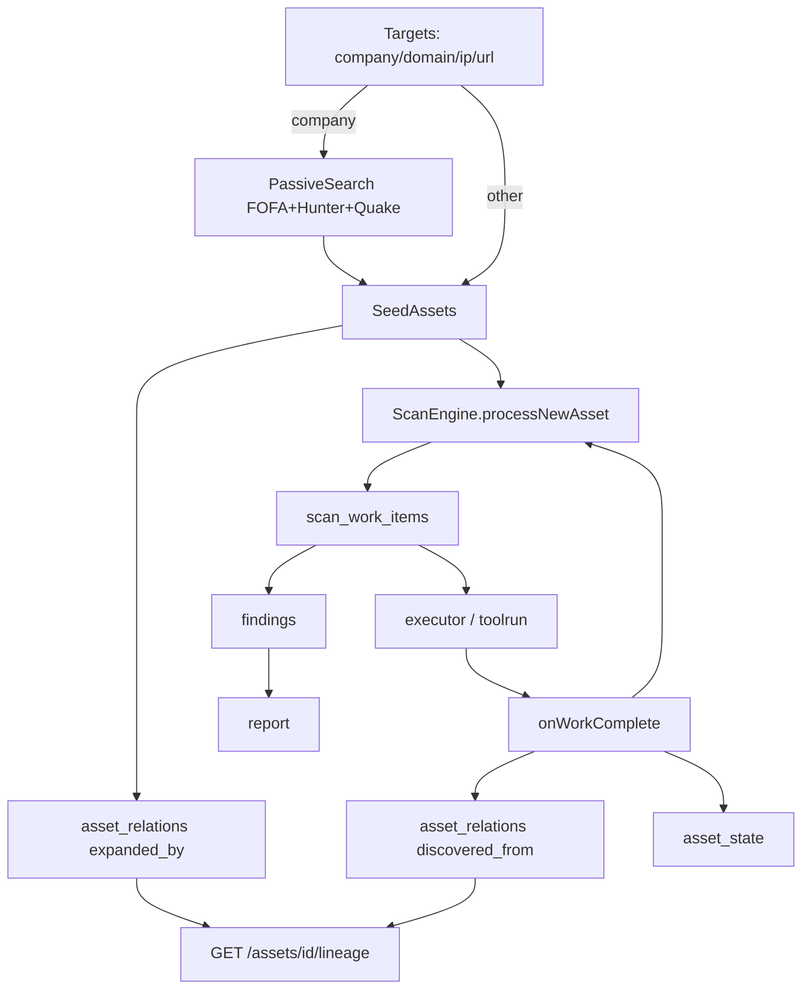

# Scan Engine 收敛 — Design

## 架构决策

### AD-1: ScanEngine 保持唯一执行器

不引入 DAG 框架。继续 **资产类型 + AssetAttrs 门控** 派生 Work。收敛重点是 seed 层、持久化层、Profile 默认值，不是重写 scheduler。

### AD-2: company 是 Target，不是 Asset

`targets.type=company` 保留为 Tier-0 输入，不 merge 进 `assets` 表。展开产物（domain/ip/url）才是 ScanEngine 的 `DiscoveryAsset` seed。

血缘：`targets(id)` ──expanded_by──► `assets(id)`，relation 表同时支持 asset→asset。

### AD-3: Seed 层返回 SeedAsset 而非 []string

```go
// internal/scanengine/seed/types.go
type SeedAsset struct {
    Value      string              // domain / ip / url 字符串
    ValueType  string              // domain | ip | url
    Source     string              // fofa | hunter | quake | crt | seed | target
    SourceRef  string              // 可选：company target id 或 parent target id
    Raw        *search.SearchResult // 可选：被动结果预填
}
```

`ExpandTargets` 签名变更：

```go
func ExpandTargets(ctx context.Context, queries *db.Queries, cfg models.PipelineConfig, targets []*models.Target) []SeedAsset
```

`pipeline_handlers.go` 传入 `cfg`；engine `Run()` 接受 `[]SeedAsset` 或在内部转换。

### AD-4: PassiveSearch 三引擎并行 fail-soft

```text
expandCompany(ctx, cfg, company, sourceTargetID)
  ├─ if !cfg.EnablePassiveSearch → return nil, log
  ├─ engines := []{fofa, hunter, quake} // 按 credential 存在性过滤
  ├─ errgroup / 手动 goroutine + mutex dedup
  ├─ dedup key: normalized(value) + valueType
  └─ respect PassiveSearchResultLimit per engine
```

**查询模板**（与现有客户端对齐）：

| 引擎 | 查询 |
|------|------|
| FOFA | 现有 `SearchCompany`（org/cert/title） |
| Hunter | `company.name="<name>"` 或 API 等价 |
| Quake | `cert:"<name>" OR title:"<name>"` |

统一转换：`search.SearchResult` → `SeedAsset`（提取 Domain/IP/URL）。

### AD-5: asset_relations  schema

```sql
CREATE TABLE asset_relations (
    id TEXT PRIMARY KEY,
    project_id TEXT NOT NULL,
    run_id TEXT,                    -- 可选，run 级血缘
    source_type TEXT NOT NULL,      -- target | asset
    source_id TEXT NOT NULL,
    target_type TEXT NOT NULL,      -- asset
    target_id TEXT NOT NULL,
    relation_type TEXT NOT NULL,    -- expanded_by | discovered_from | resolves_to | contains
    source_engine TEXT,             -- fofa | hunter | quake | subfinder | httpx | ...
    created_at DATETIME DEFAULT CURRENT_TIMESTAMP,
    UNIQUE(project_id, source_type, source_id, target_type, target_id, relation_type, run_id)
);
```

**relation_type 最小集**：

| 类型 | 示例 |
|------|------|
| `expanded_by` | target(company) → asset(domain) |
| `discovered_from` | asset(parent) → asset(child) |
| `resolves_to` | subdomain → ip |
| `contains` | http_service → http_path |

### AD-6: asset_state 存储

方案：在 `assets` 表增加 `state_json TEXT`（或独立 `asset_states` 表 keyed by asset_id）。

```json
{
  "fingerprinted": true,
  "alive": true,
  "is_cdn": false,
  "technologies": ["nginx", "jenkins"],
  "status_code": 200
}
```

写入点：`engine.onWorkComplete` 各 parser 分支；读取点：新建 `asset.LoadAttrsForEngine(assetID)` 在派生前 hydrate。

### AD-7: high-value precondition

```go
// internal/scanengine/core/preconditions.go
func isHighValueHTTP(a *DiscoveryAsset, _ Profile) bool {
    if a.Type != AssetHTTPService && a.Type != AssetHTTPPath {
        return false
    }
    if a.Attrs.Sensitivity == "high" {
        return true
    }
    if len(a.Attrs.Technologies) > 0 {
        return true
    }
    if a.Attrs.StatusCode != nil && *a.Attrs.StatusCode >= 200 && *a.Attrs.StatusCode < 400 {
        return true
    }
    return false
}
```

katana/spoor/ffuf 的 `ActionRule.Precondition` 改为：`isHTTPServiceOrPath AND isHighValueHTTP`（外网 Profile）。

### AD-8: 删 legacy workflows（已完成 2026-06-07）

已删除 `internal/workflows/` 与 workflow HTTP 路由；`handleListWebEndpointsByProject` 迁至 `asset_handlers.go`。扫描统一经 `POST /projects/{id}/scan`。

## 数据流（目标态）



## PR 拆分（≤400 行/PR）

| PR | 阶段 | 内容 |
|----|------|------|
| PR-G0a | G0 | passive_search.go + expand 重构 + unit tests |
| PR-G0b | G0 | pipeline_handlers 传 cfg + TargetPage company UI |
| PR-G0c | G0 | E2E-COMPANY-01 |
| PR-G1a | G1 | v33 migration + model + queries |
| PR-G1b | G1 | engine 写 relations + lineage API |
| PR-G2 | G2 | asset_state 持久化 + hydrate |
| PR-G3 | G3 | Profile 收敛 + preconditions 提取 |
| PR-G4 | G4 | 删 workflows + 前端统一入口 |
| PR-G5 | G5 | 文档全量同步（可拆入各 PR） |

## 测试策略

| 层级 | 覆盖 |
|------|------|
| Unit | seed passive_search mock；preconditions；relation CRUD；state R/W |
| Integration | expand → engine seed 注入（fake executor） |
| E2E | company UI → scan → finding；smoke work 数 + finding 存在 |
| 手工 | functional-test.md FT-PASSIVE-01、FT-LINEAGE-01 |

## 文档同步清单

| 代码变更 | 文档 |
|----------|------|
| 删 workflow 路由 | `internal/api/README.md` |
| seed/Profile 行为 | `docs/current/architecture.md` |
| 新 lineage API | `internal/api/README.md` |
| 验收场景 | `docs/functional-test.md` |
| workstream 状态 | `docs/current/plan.md` |
