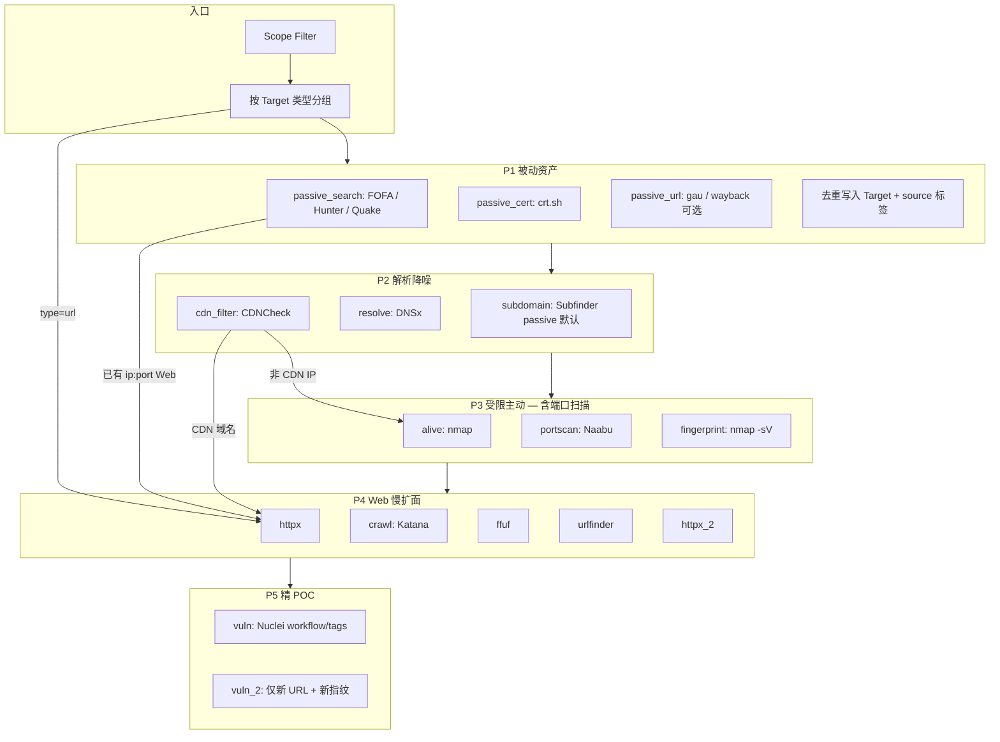

# 外网扫描管线设计（细化版）

> **状态**：In Review — **阶段定义与外网 preset 仍有效**；**执行模型**（`runDomainFlow` 顺序编排）已由 `docs/superpowers/specs/2026-05-29-asset-driven-scan-engine-design.md` 取代，外网 P1–P5 改为 `ScanProfile.external` 规则集。
>
> 实现扫描引擎时以 2026-05-29 spec 为准；本文 §4 阶段表、§6 配置默认值仍作为 Profile 与 UI 标签来源。
>
> **读者**：实现 Agent、Review、E2E 编写者。

## 1. 背景与结论（含端口扫描）

### 1.1 问题

- 内网扫描（`internal`）已较完整：存活 → 端口 → 服务指纹 → Web → Nuclei。
- 外网（`external`）在代码上与内网**共用同一套主动链路**（`runDomainFlow` / `runIPFlow`），仅多开 FOFA/Subfinder/DNSx/CDN；产品叙事强调「被动 + 慢扫 + 精 POC」，但**默认参数仍偏内网**（如 `port_range: top1000`、`nuclei_scan_depth: tags`）。
- Hunter/Quake 仅有 Engines 页手动搜索，**未进入 Pipeline**。

### 1.2 核心结论（回答「外网不做端口扫描么？」）

**外网要做端口扫描。** 与内网的差异不是「扫不扫」，而是：

| 维度 | 内网 `internal` | 外网 `external` |
|------|-----------------|-----------------|
| 是否端口扫描 | ✅ 默认全开 | ✅ **保留** nmap alive → Naabu → nmap -sV |
| 端口范围 | 常 `top1000` / 自定义 | 默认 **`top100` 或 `high-risk`**，全端口需显式 opt-in |
| 速率 | Naabu 高 rate | **显著降速**（如 200–500 pps） |
| 触发条件 | 解析到的 IP 尽量扫 | **CDN/WAF IP 可跳过**；被动搜索已给出的 `ip:port` 可**直送 httpx** |
| 优先级 | 端口与 Web 并行重要 | **被动资产与 Web 深化优先**；端口是「补盲」，不是主手段 |

外网「偏重被动」= 被动层**先于且宽于**端口层，而不是取消端口层。

### 1.3 设计目标

1. **P1 被动**：搜索引擎 + 证书/历史 URL，扩 Target，低噪声。
2. **P2 解析降噪**：DNSx、CDNCheck，决定谁进入 P3。
3. **P3 受限主动**：存活 + **限速端口扫描** + 服务指纹。
4. **P4 Web 慢扩面**：httpx → 爬虫/目录/URL 聚合 → httpx_2。
5. **P5 精 POC**：指纹驱动 workflow，无指纹不扫；二遍仅针对新 URL。

### 1.4 非目标

- 外网默认 masscan 全端口、sqlmap/hydra 暴力。
- 替换现有 Pipeline 框架或 Worker 协议。
- 本阶段不做 asset_relations 图谱 UI（可复用 v2.1 #4 后端表，P2 仅写边）。

---

## 2. 与现有代码的映射

### 2.1 已有能力（不重写）

| 能力 | 位置 | 外网复用方式 |
|------|------|--------------|
| 模式开关 | `internal/api/pipeline_handlers.go` `buildConfigForMode` | 扩展为 **preset + 细项** |
| Domain/IP 流 | `internal/workflow/pipeline_flow.go` | 插入 P1 阶段；P3 参数由 preset 注入 |
| Post-phase | `internal/workflow/pipeline.go` `runPostPhase` | 扩展 crawl；统一 URL 队列 |
| 指纹 → Nuclei | `internal/nuclei/tagmapper.go` `MapPreciseTags` / `GroupEndpointsByTags` | 外网默认 workflow；强化「无 tag 跳过」 |
| ffuf / URLFinder | `pipeline_tool.go` | 外网保留；加 tier / 触发条件 |
| FOFA Company | `runCompanyFlow` | 并入 `passive_search` |
| Hunter/Quake 客户端 | `internal/search/` | Pipeline 注入，与 FOFA 同接口形态 |

### 2.2 需新增

| 能力 | 建议包/文件 | 说明 |
|------|-------------|------|
| 外网 preset | `internal/models/engine.go` + `DefaultExternalPipelineConfig()` | 与 `DefaultPipelineConfig()` 并列 |
| 被动搜索编排 | `internal/workflow/pipeline_passive.go` | FOFA+Hunter+Quake，不塞满 `pipeline_flow.go` |
| crt.sh / gau | `internal/passive/` 或 `internal/search/` | 小客户端 + 解析 |
| Katana | `internal/workflow/pipeline_crawl.go` + `worker.BuildKatanaCommand` | allowlist 注册 |
| 阶段 ID | `internal/workflow/pipeline_stage.go` | 见 §4 |
| 引擎凭证 | 已有 `engine_credentials` | `passive_search` 按 engine 启停 |

---

## 3. 管线总览



**执行顺序（硬约束）**

1. P1 与 P2 对 `domain` / `company` **串行**：先被动扩 Target，再 Subfinder/DNS（Subfinder 输入 = 被动结果 ∪ 种子域）。
2. P3 仅对 **非 CDN 的解析 IP** 跑 alive → Naabu → nmap -sV（与现 `runDomainFlow` 一致，受 preset 限速）。
3. P4 在 **任意 Web 入口** 之后：初探 httpx →（可选）crawl/ffuf/urlfinder → httpx_2。
4. P5：`vuln` 在 P3 后第一轮；`vuln_2` 仅在 P4 发现新 URL 后。

---

## 4. 阶段（Stage）定义

### 4.1 阶段表

| StageID | 中文名 | 阶段 | 工具 | 新建? |
|---------|--------|------|------|-------|
| `search` | 被动搜索 | P1 | FOFA（company）/ Hunter / Quake | 扩展 |
| `passive_cert` | 证书子域 | P1 | crt.sh API | ✅ |
| `passive_url` | 历史 URL | P1 | gau（优先）或 waybackurls | ✅ |
| `subdomain` | 子域枚举 | P2 | Subfinder（外网默认 `-passive`） | 行为变 |
| `resolve` | DNS 解析 | P2 | dnsx | 已有 |
| `cdn_filter` | CDN 过滤 | P2 | cdncheck | 已有 |
| `alive` | 存活探测 | P3 | nmap | 已有 |
| `portscan` | 端口扫描 | P3 | **Naabu** | 已有 |
| `fingerprint` | 服务指纹 | P3 | nmap -sV | 已有 |
| `httpx` | Web 探活 | P4 | httpx + RBKD finger | 已有 |
| `crawl` | 站点爬虫 | P4 | katana | ✅ |
| `ffuf` | 目录爆破 | P4 | ffuf | 已有 |
| `urlfinder` | URL 提取 | P4 | URLFinder | 已有 |
| `httpx_2` | 二次 Web 探活 | P4 | httpx | 已有 |
| `vuln` | 漏洞扫描 | P5 | nuclei | 已有 |
| `vuln_2` | 二次漏洞扫描 | P5 | nuclei | 已有 |

`classify` 若 UI 仍展示可保留；逻辑上 Scope + 分组已覆盖。

### 4.2 失败语义（与现网一致）

- 任一 stage `failed` → run `failed`（`pipeline.go` 终态结算）。
- **P3 端口层**：nmap alive 失败 → **不 fallback 扫全部 IP**（现逻辑）；Naabu 失败 → stage 失败，但不阻断 P4（若已有 URL/域名入口）。
- **被动 API 单引擎失败**：记 `search` 子状态或聚合 error，**不阻断**其他引擎（fail-soft per engine）。

---

## 5. 按目标类型的路由

| Target 类型 | P1 | P2 | P3 端口扫描 | P4 | P5 |
|-------------|----|----|-------------|----|----|
| `company` | FOFA + Hunter + Quake（org/icp/title 查询集） | — | 展开 domain/ip 后各自路由 | — | — |
| `domain` | passive_cert + passive_url（根域） | Subfinder passive + DNSx + CDN | 非 CDN IP：**alive → Naabu → nmap -sV** | 全链路 | vuln + vuln_2 |
| `ip` | 可选 Quake `ip:` 查询 | CDN | **同上** | Web 端口 → httpx 链 | 同上 |
| `cidr` | — | 由 scope 展开为 IP | 每 IP 同 `ip` | 同 `ip` | 同 `ip` |
| `url` | passive_url（host 提取） | — | **跳过 P3** | httpx → crawl/ffuf → httpx_2 | vuln + vuln_2 |

### 5.1 CDN / 被动已有端口的分流

```
对每个解析结果 (host, ip, ports_known):
  if host 在 CDN 结果中:
    → 仅 Web 链（httpx 用域名或 CDN 边缘），不 Naabu(ip)
  else if passive_search 已返回 (ip, port) 且 port ∈ {80,443,8080,...}:
    → 可选跳过 Naabu，直接加入 httpx 输入集（配置项 skip_portscan_if_passive_has_web_port）
  else:
    → 标准 P3 端口扫描
```

默认：**不跳过** P3（保守），MVP 后再加「被动已有 Web 端口则跳过 Naabu」开关。

### 5.2 搜索引擎并入 Pipeline（Hunter/Quake）

- **触发**：`enable_passive_search=true` 且对应 `engine_credentials` 存在。
- **查询模板**（company，`t.Value` = 企业名）：

| 引擎 | 查询示例 | 与 FOFA 关系 |
|------|----------|--------------|
| FOFA | 现有 `SearchCompany` | 保留 |
| Hunter | `company.name="…"` 或 API 文档等价 | 并行 |
| Quake | `cert:"…" OR title:"…"` | 并行 |

- **产出**：`SearchResult` → `Target`（`source=fofa|hunter|quake`），去重键 = `(type, value)`。
- **限额**：`passive_search_result_limit`（默认 500/引擎）、`passive_search_concurrency`（默认 3）。

Engines 页手动搜索 **保留**，作为 Pipeline 之外的调研入口。

---

## 6. 配置模型

### 6.1 新增字段（`PipelineConfig`）

```go
// External profile — 仅 mode=external 时由 preset 填充，用户可在 ScanModal 覆盖
EnablePassiveSearch     bool   `json:"enable_passive_search"`      // FOFA+Hunter+Quake 自动
EnablePassiveCert       bool   `json:"enable_passive_cert"`        // crt.sh
EnablePassiveURL        bool   `json:"enable_passive_url"`         // gau/wayback
SubfinderMode           string `json:"subfinder_mode"`             // "passive" | "active" | "off"
EnableKatana            bool   `json:"enable_katana"`
KatanaMaxDepth          int    `json:"katana_max_depth"`           // default 2
KatanaRateLimit         int    `json:"katana_rate_limit"`          // default 10 req/s
FfufTier                string `json:"ffuf_tier"`                  // "small" | "medium" | "off"
SkipPortscanOnCDNHost   bool   `json:"skip_portscan_on_cdn_host"`  // default true
NucleiRequireFingerprint bool  `json:"nuclei_require_fingerprint"` // default true：无 tag 不扫
```

保留现有 `port_range`、`naabu_*`、`nuclei_*`、`enable_*` 字段；外网 preset **覆盖默认值**，不删除字段。

### 6.2 外网默认 preset（`DefaultExternalPipelineConfig()`）

在 `DefaultPipelineConfig()` 基础上覆盖：

| 字段 | 内网默认 | 外网 preset |
|------|----------|-------------|
| `port_range` | top1000 | **top100** |
| `naabu_rate` | 1000 | **300** |
| `naabu_threads` | 100 | **50** |
| `subfinder` | enable, 主动 | enable, **`subfinder_mode: passive`** |
| `enable_passive_search` | — | **true** |
| `enable_passive_cert` | — | **true** |
| `enable_passive_url` | — | **true** |
| `nuclei_scan_depth` | tags | **workflow** |
| `nuclei_rate_limit` | 100 | **20** |
| `nuclei_concurrency` | 25 | **5** |
| `nuclei_rate_limit_per_min` | 0 | **30** |
| `ffuf_rate_limit` | 6 | **4** |
| `enable_katana` | — | **true** |
| `katana_max_depth` | — | **2** |
| `katana_rate_limit` | — | **10** |
| `nuclei_require_fingerprint` | — | **true** |

`buildConfigForMode("external", cfg)` 逻辑：

1. 以 `DefaultExternalPipelineConfig()` 为底。
2. 用请求体 `cfg` 中非零/非空字段覆盖（与现 `buildConfigForMode` 一致）。
3. 设置现有 `EnableFOFA/Subfinder/DNSx/CDN/...` 布尔（保持 true，Subfinder 行为由 `subfinder_mode` 控制）。

### 6.3 ScanModal UX（概要）

- 外网模式显示 **两 Tab**：「被动与资产」「主动与漏洞」（或折叠组）。
- **端口扫描**显式展示：端口预设（top100 / high-risk / 自定义）、Naabu 速率——避免用户误以为外网不扫端口。
- Subfinder：**被动 / 主动** 单选，默认被动。
- Nuclei：**workflow / tags / both**，外网默认 workflow；提示「无指纹目标将跳过」。

---

## 7. 工具与 allowlist

| 工具 | 外网角色 | allowlist 名 | 备注 |
|------|----------|--------------|------|
| fofa | P1 | 已有 | Company |
| hunter | P1 | 新增 API 客户端，非 exec | HTTP |
| quake | P1 | 同上 | HTTP |
| crt.sh | P1 | `curl` 或 Go HTTP | 限频 |
| gau | P1 | `gau` | 子进程 |
| subfinder | P2 | `subfinder` | 外网 CLI 加 `-passive` |
| dnsx | P2 | `dnsx` | |
| cdncheck | P2 | `cdncheck` | |
| nmap | P3 | `nmap` | alive + -sV |
| naabu | P3 | `naabu` | **外网核心端口层** |
| httpx | P4 | `httpx` | |
| katana | P4 | `katana` | 新增 |
| ffuf | P4 | `ffuf` | |
| urlfinder | P4 | `urlfinder` | |
| nuclei | P5 | `nuclei` | |

**Katana 建议参数（实现时写入 `BuildKatanaCommand`）**

- `-list` 来自 httpx 输出 URL
- `-depth` = `katana_max_depth`
- `-rate-limit` = `katana_rate_limit`
- `-js-crawl` 可选默认 on
- 不抓离域（`-field-scope` / 等价 flag 以官方 CLI 为准）

**Ffuf tier**

| tier | 字典 | 触发 |
|------|------|------|
| small | `builtin:dict` 中小字典 | 所有 200/403 endpoint |
| medium | 中型字典 | 仅 httpx 有明确指纹的 endpoint |
| off | — | 不跑 |

实现：`ffuf_tier` 映射到 `ffuf_dictionary_id` 预设 ID（DB seed 或 builtin 路径）。

---

## 8. P5 精 POC 规则

### 8.1 Web

1. `GroupEndpointsByTags` 分组；若 `nuclei_require_fingerprint=true`，**空 tag 组不调用 nuclei**（现逻辑已 omit，外网 preset 强制开启并打日志）。
2. `nuclei_scan_depth` 默认 `workflow`：对每个 tag 调 `customWorkflowPaths()` 下 `{tag}.yaml`。
3. `both` 仅高级用户；外网不推荐默认。
4. 速率：`-rl` + `-rlm` + `-c` 来自 preset（§6.2）。

### 8.2 非 Web

- 保留 `runNucleiNonWeb`（nmap service → tag）。
- 外网 preset：**仅 high-risk 端口**上的非 Web 服务跑 Nuclei；实现方式 = `port_range: high-risk` 时非 Web 结果集已缩小，或增加 `nuclei_nonweb_enabled`（默认 true，与内网一致）。

### 8.3 二遍 `vuln_2`

- 输入：`feedToHttpxNuclei` 产生的新 `WebEndpoint`。
- 规则与第一遍相同；**禁止**对第一遍已扫过的 `(url, tag_set)` 重复（现有 `filterURLsForSecondaryScan` + dedup）。

---

## 9. 数据与可观测性

### 9.1 Target.source 扩展

允许值增加：`hunter`、`quake`、`crt`、`gau`、`katana`、`ffuf`（已有 fofa/subfinder 等）。

### 9.2 asset_relations（可选，E6）

| relation_type | source | target |
|---------------|--------|--------|
| `belongs_to` | domain | ip |
| `discovered_by` | target | engine_name |
| `parent_of` | domain | subdomain |

写入时机：P1 合并后批量插入。

### 9.3 Run 展示

- Runs 页 stage 时间线按 §4 顺序展示；P1 三 stage 可折叠为「被动收集」。
- 统计：被动新增 Target 数 / 端口扫描发现数 / 爬虫+ffuf 新 URL 数 / Nuclei 调用组数。

---

## 10. 实现分期与验收

| 期 | 交付 | E2E 验收信号 |
|----|------|----------------|
| **E0** | 设计文档 + `DefaultExternalPipelineConfig` + `buildConfigForMode` 应用 preset + 更新 architecture 摘要 | 外网扫描创建后 DB 中 `pipeline_config` 含 `port_range: top100`、`nuclei_scan_depth: workflow` |
| **E1** | Hunter/Quake 并入 `runCompanyFlow` / domain 种子查询 → `StageSearch` | mock API：company 扫描产出 `source=hunter` 的 Target |
| **E2** | crt + subfinder passive + gau；`passive_cert` / `passive_url` stage | domain 扫描多出 `*.crt` 子域或历史 URL |
| **E3** | Katana + `StageCrawl`；URL 并入 post-phase 队列 | crawl stage completed；新 URL 进入 httpx_2 |
| **E4** | ffuf tier；CDN 跳过端口（`skip_portscan_on_cdn_host`） | CDN IP 无 `portscan` stage 记录；非 CDN 仍有 |
| **E5** | `nuclei_require_fingerprint`；外网日志可审计跳过数 | 无指纹 endpoint 无 nuclei task |
| **E6** | asset_relations + Runs 统计 | 报告或 API 可查到 domain→ip 边 |

**每期必须**：相关 Go 单测 + 至少一条 Playwright 或 pipeline integration（`//go:build e2e`）用 mock 引擎。

---

## 11. 风险与约束

| 风险 | 缓解 |
|------|------|
| 被动 API 配额耗尽 | per-engine limit；fail-soft；UI 显示配额 |
| 外网端口扫描触发封禁 | 默认 top100 + 低 naabu_rate；`-rlm` on nuclei |
| Katana/ffuf 误扫离域 | scope.FilterTargets 对 URL 同样生效；Katana scope flag |
| 扫描时长膨胀 | 阶段可单独 disable；preset 可存项目级 |
| Worker 无某二进制 | health check + stage fail 明确信息 |

**合规**：仅扫描授权目标；Scope 规则为硬门禁（现有 `scope.FilterTargets`）。

---

## 12. 决策记录

| ID | 决策 | 理由 |
|----|------|------|
| D1 | 外网 **保留** Naabu + nmap -sV | 被动源不完整；端口是补盲与 non-Web 入口 |
| D2 | 外网默认 **top100** 非 top1000 | 降噪、降封禁风险 |
| D3 | 被动 **先于** 主动子域 | 符合「偏重被动」产品定位 |
| D4 | CDN IP **默认不** Naabu | 避免扫 CDN 边缘无效端口 |
| D5 | Nuclei 外网默认 **workflow** | 精 POC；tags 作高级选项 |
| D6 | Katana 放在 httpx 之后、ffuf 之前 | 先确认存活与指纹，再爬链 |
| D7 | Hunter/Quake 与 FOFA **并行** fail-soft | 单点失败不毁 run |

---

## 13. 文档同步清单（实现完成后）

- [ ] `docs/current/architecture.md` — 外网五阶段 + 端口策略 + stage 表
- [ ] `docs/current/plan.md` — External Scan Revive 工作流
- [ ] `frontend` ScanModal 文案与 architecture 一致
- [ ] `internal/api/README.md` — 若新增 handler 字段

---

## 14. 开放问题（实现前可确认）

1. **gau vs waybackurls**：优先 gau（单二进制、输出稳定）；wayback 作 fallback？
2. **Subfinder passive 是否与 crt 去重合并**：建议合并后写 Target，`source` 保留多值或主 source + metadata JSON。
3. **全端口外网**：是否在 UI 标「高风险」并二次确认 — 建议是。

---

*Spec self-review: 无 TBD 占位；端口扫描在 §1.2、§3、§5、§7、D1 四处一致；阶段与现有 `pipeline_stage.go` 对齐并标注新增项。*
