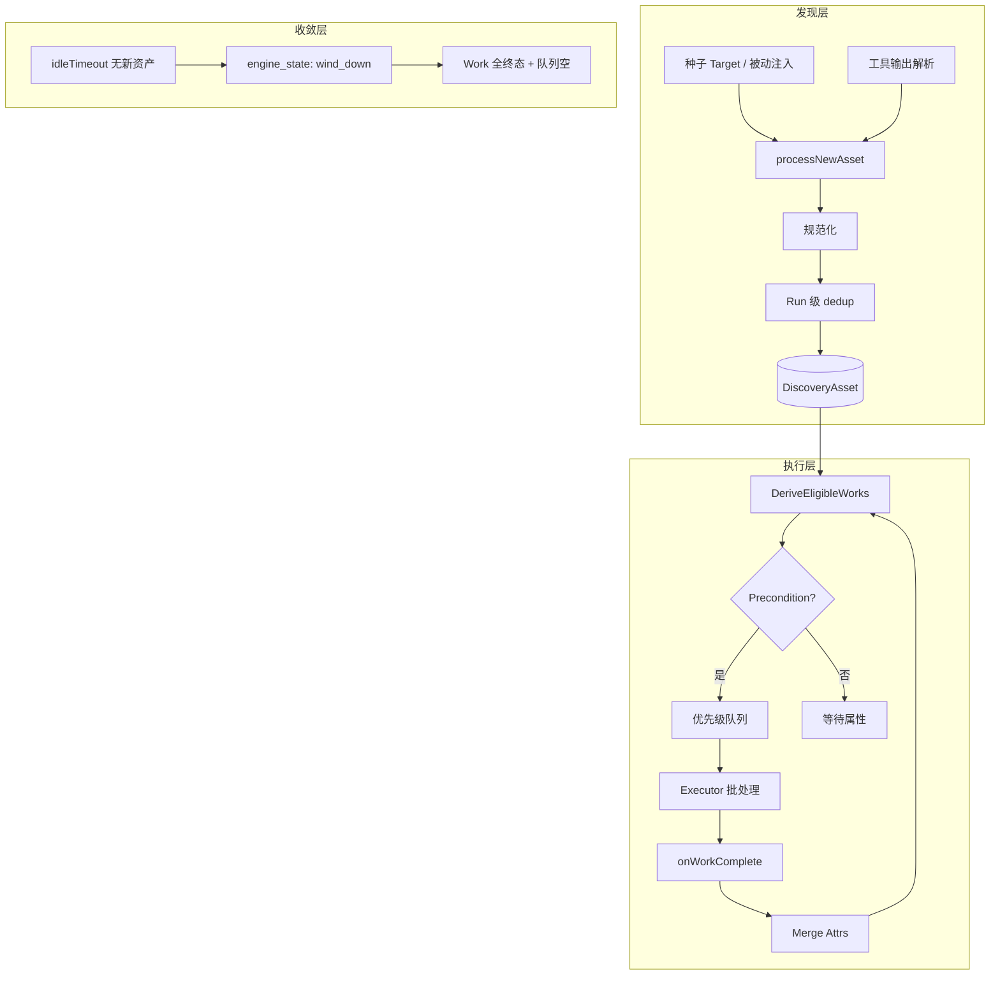

# 资产驱动扫描引擎设计

> **状态**：已确认（2026-05-29）— 实现前以本文为准；落地后同步 `docs/current/architecture.md` 与 `internal/api/README.md`（若有新路由）。
>
> **读者**：实现 Agent、Review、E2E 编写者、前端改版者。
>
> **关系**：取代 `2026-05-25-external-scan-pipeline-design.md` 的**执行模型**（阶段流水线 → 资产图 + Work）。外网 P1–P5 **保留为 ScanProfile 规则与 Stage 聚合名称**，不再用 `runDomainFlow` 硬编码顺序。

## 1. 背景与结论

### 1.1 现状问题

| 问题 | 表现 |
|------|------|
| 阶段流水线 | `runDomainFlow` 等按固定顺序跑 stage；新 URL 靠 `httpx_2` / `vuln_2` 补丁 |
| 多工具消费 | 同一 URL 需 httpx / katana / ffuf / nuclei，无法用单一「已消费」标记表达 |
| 门控分散 | CDN 跳过端口、`nuclei_require_fingerprint` 等散落在各 stage |
| 深度失控 | url1→url2→url3 每层全套工具，难以收敛 |
| 前端假设 | `RunsPage.tasksInStage` 用 stage 时间窗 + tool 白名单猜任务，与并行/回流不符 |

### 1.2 结论

采用 **资产图 + Work(资产×动作) + 属性门控 + 收敛状态机** 作为扫描**执行内核**；对产品和 UI **保留 Stage 时间线（聚合投影）**，Runs 页 **任务列表以全局时间序为主、stage 为辅**。

**落地位置**：`internal/scanengine/`（不新建独立 `scanner-engine/` 仓库目录）。复用 `scope`、`toolrun`、`toolregistry`、`asset.Merger`、`worker.ResourceGovernor`。

### 1.3 已确认决策（2026-05-29）

| ID | 决策 |
|----|------|
| C1 | 阶段 UI：保留 `pipeline_run_stages` + SSE `pipeline_stage_change`，由 **StageAggregator** 按 Work 聚合 |
| C2 | Runs 任务列表：**全局时间序为主**，stage 展开为辅；废弃 `tasksInStage` 时间窗逻辑 |
| C3 | 新建表 **`scan_work_items`** |
| C4 | 资产页：**单资产 Work 时间线抽屉** |
| C5 | 外网五阶段改为 **ScanProfile.external** 规则，取代 stage 流水线执行模型 |
| C6 | **`MaxDiscoveryDepth` 默认 2**；**katana / ffuf 默认仅 `DiscoveryDepth ≤ 1`** |
| C7 | 文档路径：`specs/2026-05-29-*` + `plans/2026-05-29-*` |

---

## 2. 执行内核

### 2.1 三层架构



### 2.2 核心实体

#### DiscoveryAsset（引擎 DTO）

| 字段 | 说明 |
|------|------|
| `ID` | `SHA256(normalized_value + method + type)` 或与 Merger 一致 |
| `Type` | `SUBDOMAIN` / `IP` / `IP_PORT` / `HTTP_SERVICE` / `HTTP_PATH` / `JS_URL`（JS 入图后规范化为 HTTP_PATH） |
| `Value` / `NormalizedValue` | 原始与规范化值 |
| `ParentID` | 发现父资产 |
| `DiscoveryDepth` | 从种子起跳数；**新规范化资产才 +1** |
| `Attrs` | 门控属性（见 §2.4） |
| `SourceTool` | katana / ffuf / seed / … |

**持久化**：经 `asset.Merger` 写入现有 `assets` / `web_endpoints` / `ports`；引擎字段 `discovery_depth` 写入 DB（见 §6）。

#### Work

| 字段 | 说明 |
|------|------|
| 唯一键 | `(run_id, asset_id, action)` |
| `Action` | `TaskAction` 枚举（与工具映射见 §5） |
| `Status` | `pending` / `running` / `done` / `skipped` / `failed` |
| `SkipReason` | `skipped` 时人类可读原因（如 `cdn_host` / `no_fingerprint`） |

**同一 URL 上 httpx、katana、ffuf、nuclei 各一条 Work**，互不覆盖。

#### ScanProfile

| Profile | 用途 |
|---------|------|
| `internal` | 内网默认规则集 |
| `external` | 外网 P1–P5 能力（被动种子 + 限速端口 + 慢 Web + 精 POC） |
| `url_only` | 跳过端口层 |

由 `PipelineConfig` + `buildConfigForMode` 构建；`ActionRule.Enabled` 读取配置布尔与 tier。

#### EngineState（run 级）

| 状态 | 含义 |
|------|------|
| `running` | 正常派生并入队 |
| `wind_down` | `idleTimeout` 触发；仅允许收尾类 Action（默认：Nuclei、可选 httpx） |
| `stopped` | 全 Work 终态、队列空或 `absoluteTimeout` |

### 2.3 派生时机（两拍）

1. **`processNewAsset`**：scope → dedup → 写入图 → `DeriveEligibleWorks` → 仅入队满足 Precondition 的 Work。  
2. **`onWorkComplete`**：`MergeAttrs` → 再次 `DeriveEligibleWorks` → 入队新 Work；工具发现的**子资产**走 `processNewAsset`（不重复派父资产同一 Action）。

### 2.4 属性门控 AssetAttrs

```go
type AssetAttrs struct {
    Alive         *bool    // nmap alive 后设置
    IsCDN         *bool    // cdncheck 后设置
    Fingerprinted bool     // httpx 完成后 true
    Technologies  []string
    StatusCode    *int
    SourceTool    string
}
```

### 2.5 ActionRule 与默认深度

**全局**：`MaxDiscoveryDepth = 2`（`PipelineConfig` 可覆盖）。

**按 Action 的 `MaxDepth`（默认）**：

| Action | MaxDepth | Precondition 摘要 |
|--------|----------|-------------------|
| `PASSIVE_SEARCH` / `PASSIVE_CERT` / `PASSIVE_URL` | 0 | Profile.external + 配置 enable |
| `SUBDOMAIN_ENUM` | 1 | 子域资产 |
| `DNS_RESOLVE` / `CDN_CHECK` | — | 子域/IP 链路上下文 |
| `PORT_SCAN` (naabu) | 2 | IP 资产；`Alive==true`；`IsCDN!=true`；或 skip 记 `skipped` |
| `SERVICE_FINGERPRINT` (nmap -sV) | 2 | 端口资产 |
| `HTTPX_FINGERPRINT` | 2 | Web 入口 |
| `KATANA_CRAWL` | **1** | HTTP_SERVICE/PATH；`enable_katana` |
| `FFUF_BRUTE` | **1** | HTTP_SERVICE；`ffuf_tier != off` |
| `NUCLEI_SCAN` | 2 | HTTP_* ；`!nuclei_require_fingerprint \|\| Fingerprinted` |

**来源限制（防爬虫链爆炸）**：

- `SourceTool == "katana"` 且 `DiscoveryDepth >= 2` → 不生成 `KATANA_CRAWL`。
- 规范化 dedup：同一 `NormalizedValue` 不入图、不增加 depth。

**每 host 新 URL 预算**（可选，A2+）：`MaxNewURLsPerHost` 默认 500，可配置。

### 2.6 收敛规则

| 条件 | 行为 |
|------|------|
| `time.Since(lastNewAsset) > idleTimeout` 且队列空 | → `engine_state = wind_down` |
| `wind_down` 且队列空且无非终态 Work | → `stopped` |
| `time.Since(runStart) > absoluteTimeout` | 强制 `stopped` |
| `DiscoveryDepth > MaxDiscoveryDepth` | 拒绝入图 |

**结束判定**：以 **`scan_work_items` 全为 done/skipped/failed** 为准，不以「是否还有 URL 资产」为准。

### 2.7 Findings 与资产回流

- **Nuclei** 产出 → `FindingBuffer` + 辞典匹配；**默认不**再生成可爬 `DiscoveryAsset`。  
- **Katana/ffuf/httpx** 产出 URL → `processNewAsset`（新 Work 由规则派生）。

---

## 3. 包结构

```
internal/scanengine/
  core/           discovery_asset.go, task.go, attrs.go, rules.go, profile.go
  work/           store.go, claim.go
  queue/          priority.go
  dedup/          run_dedup.go
  executor/       batcher.go, register.go, nuclei.go, httpx.go, ...
  stageagg/       aggregator.go    # TaskAction → StageID
  engine.go       ScanEngine
  config.go       EngineConfig from PipelineConfig
```

**逐步替代**：`internal/workflow/pipeline_flow.go` 主路径；`discovery.go` / `screenshot.go` 维护至能力对齐。

---

## 4. Stage 聚合（UI 兼容层）

### 4.1 原则

- **真相**：`scan_work_items` + `scan_tasks`（子进程）+ run metrics。  
- **投影**：`pipeline_run_stages` 行 + `pipeline_stage_change` SSE。  
- Stage **无严格先后顺序**；同一 stage 可多轮 `running`（回流 URL）。

### 4.2 StageID 映射（保留现有 ID）

| StageID | 聚合的 TaskAction / 说明 |
|---------|--------------------------|
| `search` | passive_search (fofa/hunter/quake) |
| `passive_cert` | PASSIVE_CERT |
| `passive_url` | PASSIVE_URL |
| `subdomain` | SUBDOMAIN_ENUM |
| `resolve` | DNS_RESOLVE |
| `cdn_filter` | CDN_CHECK |
| `alive` | HOST_ALIVE (nmap) |
| `portscan` | PORT_SCAN |
| `fingerprint` | SERVICE_FINGERPRINT |
| `httpx` | HTTPX_FINGERPRINT |
| `crawl` | KATANA_CRAWL |
| `ffuf` | FFUF_BRUTE |
| `httpx_2` | 第二次及以后批次的 HTTPX（depth>0 或 source≠seed） |
| `vuln` | NUCLEI_SCAN（首轮） |
| `vuln_2` | NUCLEI_SCAN（depth>0 或 post-crawl） |

### 4.3 Stage 行扩展字段

```go
// models.PipelineRunStage 扩展（JSON 一并输出）
WorkTotal    int `json:"work_total,omitempty"`
WorkDone     int `json:"work_done,omitempty"`
WorkRunning  int `json:"work_running,omitempty"`
Round        int `json:"round,omitempty"` // 第几轮进入 running
```

**聚合算法（摘要）**：

- 该 stage 下 Work `running>0` → stage `running`。  
- 全部终态 → `completed`（若曾 failed 且无 running → `failed`）。  
- 每次从 pending→running 时 `Round++`（可选展示「第 N 轮」）。

---

## 5. 工具执行

- 所有子进程经 **`toolrun.Invoke`** + **`toolregistry`** + **`toolguard`**。  
- **`ResourceGovernor.Acquire`** 在批 flush 前调用（与现 Worker 一致）。  
- **批处理**：`executor.ToolExecutor` — `batchSize` + `flushInterval` + 负载门控；禁止在 `cmdBuilder` 内 `defer` 关闭仍被 `-l` 使用的临时文件。  
- 每个 Work flush 产生 **`scan_tasks`** 行（日志、Runs 列表），关联 `work_id`。

---

## 6. 数据模型（SQLite）

### 6.1 新表 `scan_work_items`

```sql
CREATE TABLE scan_work_items (
  id TEXT PRIMARY KEY,
  run_id TEXT NOT NULL,
  project_id TEXT NOT NULL,
  asset_id TEXT NOT NULL,
  action TEXT NOT NULL,
  status TEXT NOT NULL DEFAULT 'pending',
  skip_reason TEXT,
  stage TEXT,              -- 投影用，冗余存储
  error TEXT,
  started_at TEXT,
  completed_at TEXT,
  created_at TEXT NOT NULL,
  UNIQUE(run_id, asset_id, action)
);
CREATE INDEX idx_scan_work_items_run_status ON scan_work_items(run_id, status);
```

### 6.2 `scan_tasks` 扩展

```sql
ALTER TABLE scan_tasks ADD COLUMN work_id TEXT;
ALTER TABLE scan_tasks ADD COLUMN action TEXT;
ALTER TABLE scan_tasks ADD COLUMN asset_id TEXT;
ALTER TABLE scan_tasks ADD COLUMN stage TEXT;  -- 若尚无
```

### 6.3 资产表扩展

```sql
ALTER TABLE assets ADD COLUMN discovery_depth INTEGER DEFAULT 0;
ALTER TABLE web_endpoints ADD COLUMN discovery_depth INTEGER DEFAULT 0;
```

（`asset_relations` 图谱 UI 仍非目标；边可在 A5+ 写表。）

### 6.4 `pipeline_runs` 扩展

```sql
ALTER TABLE pipeline_runs ADD COLUMN engine_state TEXT DEFAULT 'running';
ALTER TABLE pipeline_runs ADD COLUMN last_new_asset_at TEXT;
```

---

## 7. API 与 SSE

### 7.1 HTTP

| 方法 | 路径 | 说明 |
|------|------|------|
| GET | `/projects/{id}/pipeline/runs/{runId}/stages` | **保留**；stage 含 work 计数 |
| GET | `/projects/{id}/pipeline/runs/{runId}/metrics` | **新增** |
| GET | `/projects/{id}/pipeline/runs/{runId}/works` | **新增**；分页，供调试与资产抽屉 |
| GET | `/assets/{assetId}/works?run_id=` | **新增**；单资产 Work 时间线 |

### 7.2 ScanRunMetrics

```json
{
  "engine_state": "running",
  "assets_discovered": 1204,
  "works_pending": 12,
  "works_done": 890,
  "works_skipped": 44,
  "queue_depth": { "high": 2, "medium": 5, "low": 5 },
  "last_new_asset_at": "2026-05-29T12:00:00Z"
}
```

### 7.3 SSE

| 事件 | 说明 |
|------|------|
| `pipeline_stage_change` | **保留**；payload 可含 `work_total` / `work_done` |
| `scan_metrics` | **新增**；节流 ≥1s |
| `pipeline_complete` | **保留** |
| `asset_discovered` | **可选 A2+**；默认关闭或节流 |

### 7.4 Work 时间线响应（资产抽屉）

```json
{
  "asset_id": "...",
  "run_id": "...",
  "items": [
    {
      "action": "HTTPX_FINGERPRINT",
      "status": "done",
      "stage": "httpx",
      "started_at": "...",
      "completed_at": "...",
      "skip_reason": null,
      "task_id": "..."
    }
  ]
}
```

---

## 8. 前端设计

### 8.1 Runs 页（`RunsPage.tsx`）

**布局（run 选中后右侧）**：

1. **顶栏 Run 概览**：status、`engine_state`、metrics 卡片（SSE `scan_metrics`）。  
2. **阶段进度（辅）**：纵向时间线；`STAGE_LABELS` 保留；显示 `work_done/work_total`、可选「第 N 轮」。  
3. **任务列表（主）**：`scan_tasks` **按 `started_at` 降序**；列：tool、action、target 简写、status、时长；点击展开日志。  
4. **Wind-down Banner**：`engine_state === wind_down'` 时提示收尾语义。

**删除**：`tasksInStage` 的时间窗 + `STAGE_TOOL_ALLOWLIST` 猜归属。

**Stage 展开（可选）**：点击 stage 行 → 过滤 `task.stage === stage` 或 `work.stage === stage` 的子集，**不作为主列表唯一来源**。

### 8.2 资产页（`AssetPage.tsx`）

- Web / 基础资产表增加列：**发现深度**、**来源工具**、**已指纹**（有 technologies 或 attrs）。  
- 行点击 / 操作按钮 → **抽屉**：`GET /assets/{id}/works?run_id=` 时间线（done/skipped/failed 图标 + skip_reason）。  
- 扫描进行中：metrics SSE 或 10s 轮询刷新资产列表（可配置）。

### 8.3 ScanModal

- 仍提交 `PipelineConfig`；文案增加：「扫描按资产自动推进，下方阶段为进度汇总」。  
- 外网 preset / 端口 / Nuclei 指纹提示 **保留**（与 `2026-05-25` spec §6.3 一致）。

### 8.4 类型（`frontend/src/lib/api.ts`）

```ts
export interface PipelineRunStage {
  id: string;
  run_id: string;
  stage: string;
  status: string;
  error?: string;
  started_at?: string;
  completed_at?: string;
  created_at: string;
  work_total?: number;
  work_done?: number;
  work_running?: number;
  round?: number;
}

export interface ScanRunMetrics {
  engine_state: "running" | "wind_down" | "stopped";
  assets_discovered: number;
  works_pending: number;
  works_done: number;
  works_skipped: number;
  queue_depth: { high: number; medium: number; low: number };
  last_new_asset_at?: string;
}

export interface ScanWorkItem {
  id: string;
  run_id: string;
  asset_id: string;
  action: string;
  status: string;
  skip_reason?: string;
  stage?: string;
  started_at?: string;
  completed_at?: string;
  task_id?: string;
}
```

---

## 9. 外网 Profile（取代原流水线顺序）

外网 **P1–P5 不作为代码顺序**，而作为 **种子注入 + ActionRule 启用集**：

| 原阶段 | Profile.external 行为 |
|--------|------------------------|
| P1 被动 | 种子注入器：FOFA/Hunter/Quake、crt、gau → `processNewAsset` |
| P2 解析 | Subfinder passive、dnsx、cdncheck → 写 Attrs |
| P3 端口 | PORT_SCAN 门控；CDN skip → `skipped` |
| P4 Web | httpx；depth≤1：katana/ffuf |
| P5 POC | nuclei workflow；require fingerprint |

`DefaultExternalPipelineConfig()` 字段与 `2026-05-25-external-scan-pipeline-design.md` §6.2 **保持一致**（port_range top100、naabu 300、nuclei workflow 等）。

---

## 10. 实现分期

| 期 | 交付 | 验收 |
|----|------|------|
| **A0** | 本文 + plan + migration 草案 | 评审 ✓ |
| **A1** | scanengine 骨架、WorkStore、domain 种子、httpx→nuclei、stageagg、metrics API | 单域扫描 E2E 绿；Runs metrics 展示 |
| **A2** | katana/ffuf、dedup+depth、wind_down、works API | URL 链 depth≤2；katana/ffuf 仅 depth≤1 |
| **A3** | external profile、被动种子、CDN/指纹门控 | 外网 integration test |
| **A4** | 切换主路径 off pipeline_flow；前端任务主列表 + 抽屉 | 全量 E2E |
| **A5** | `architecture.md`、API README、废弃旧执行路径注释 | 文档契约 |

---

## 11. 风险与约束

| 风险 | 缓解 |
|------|------|
| Work 表膨胀 | run 级隔离；历史 run 归档策略（未来） |
| Stage 与 Work 不一致 | 仅 stageagg 写 stage 表 |
| 前端性能 | metrics 节流；资产列表分页 |
| Worker 兼容 | scan_tasks 仍产生；work_id 关联 |

**合规**：`scope.Engine` 为硬门禁；与现网一致。

---

## 12. 决策记录

| ID | 决策 | 理由 |
|----|------|------|
| D1 | Work 粒度 = (asset, action) | 多工具消费、独立重试 |
| D2 | 属性更新后二次派生 | 指纹后才 Nuclei |
| D3 | Stage 为投影 | 用户熟悉时间线；内核非线性 |
| D4 | MaxDiscoveryDepth=2, katana/ffuf MaxDepth=1 | 用户确认；控制爆炸 |
| D5 | scan_work_items 新表 | 用户确认；与 scan_tasks 分工 |
| D6 | 外网 spec 执行模型被本文取代 | 用户确认 |

---

## 13. 文档同步清单（A5）

- [ ] `docs/current/architecture.md` — 资产驱动基线、双轨可观测性、表结构
- [ ] `docs/current/plan.md` — Active workstream
- [ ] `internal/api/README.md` — 新 handler / 路由
- [ ] `docs/superpowers/specs/2026-05-25-external-scan-pipeline-design.md` — 文首注明执行模型由本文取代

---

*Spec self-review: §8 与 C1–C7 一致；无 TBD；深度与 katana/ffuf 限制在 §2.5、§10 A2 重复处一致。*
