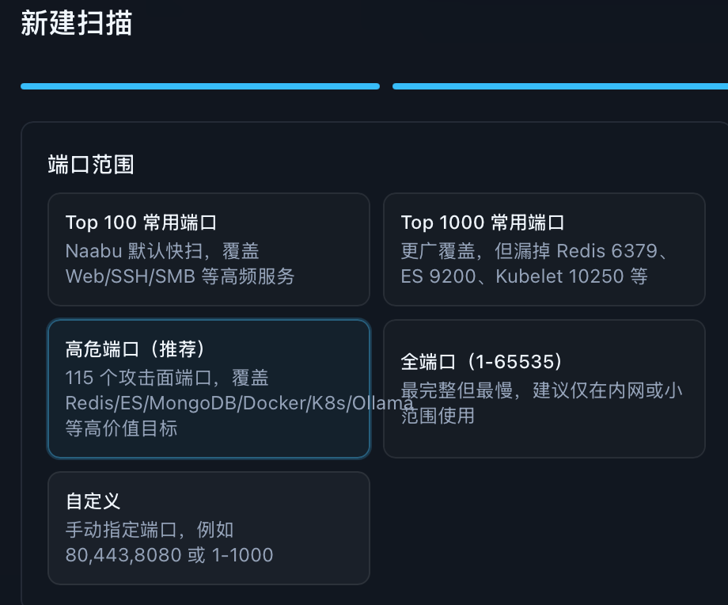
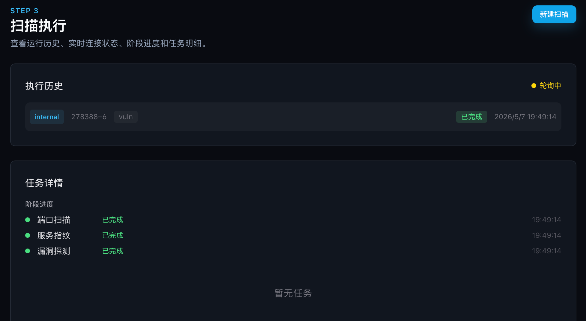

# 问题1

前端创建扫描任务后的配置弹窗中，端口范围选择的文字描述有超出卡片的情况

# 问题2
点击扫描执行历史，点开就看见端口扫描，服务指纹，漏洞探测都是已完成，完全没有进度展示功能。

# 问题3
扫描显示完成了，但是没有任何结果，1秒就完成了，我怀疑扫描没有执行。

# 问题4
扫描配置中的速度选项，每次新建扫描都会恢复默认值么，是否可以记住上次用户的选择，这样避免用户每次都要修改默认配置